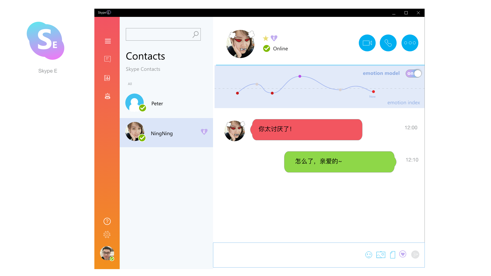

# Skype-E

## Introduction

One textual sentence might have several different interpretations, and this ambiguity of human language can easily lead to misunderstanding in online textual communication. In this demo, we designed and implemented Skype-E, an emotion-based plugin for telecommunication software like Skype. With a laptop camera, Skype-E detects and recognizes the facial expression changes of a user, and notifies the other user by re-rendering the graphical user interfaces according to the detected emotion. This plugin is activated only under the agreement of both users. The raw images captured by the camera are kept secret from other users. 

This demo was designed and implemented within 36 hours in [HACKxFDU 2016](https://www.hackx.org/projects/6), the largest coding hackathon in China at that time. We won the Microsoft Most Intelligent Award out of the 438 participators. 

## Demonstration

1. This is the normal user interface when the Skype-E plugin is not activated:

2. You will receive a notification when your friend suggest activating Skype-E. The emotion mode is turned on only under your agreement:

3. With the emotion mode turned on, our plugin will recognize your friend's facial expression every time she sends you a message. Your user interface and your friend's avatar will be re-rendered according to her recent emotion. The emotion curve of your friend is also plotted on the top of the window. The following UI suggests your friend is in a happy mood:

4. We designed four sets of UI, supporting four different emotions, including happy, neutral, angry and sad. The following UI denotes your friend is getting angry:

5. A user can also trigger the plugin actively by clicking the bottom right button. In this case, the user will send a re-rendered avatar to her friend based on her current emotion:

## Prerequisite

The following C# packages are requisite for running this demo: 

* Microsoft.ProjectOxford.Emotion.1.0.0.1
* Newtonsoft.Json.9.0.1
* AForge.2.2.5
* AForge.Controls.2.2.5
* AForge.Imaging.2.2.5
* AForge.Math.2.2.5
* AForge.Video.2.2.5
* AForge.Video.DirectShow.2.2.5

Our face detection part in the current version is based on Microsoft cognitive service APIs. Your will have to [subscribe](https://azure.microsoft.com/en-us/try/cognitive-services/my-apis/) to the APIs and replace Line 154 of [DetectionEmotion.cs](./demo/DetectionEmotion.cs) with your own subscription key.

## Teammates

* [Ning](https://github.com/xizeroplus)
* [Fuyuan Lv](https://github.com/xizeroplus)
* [Zhe Wang](https://github.com/xizeroplus)

